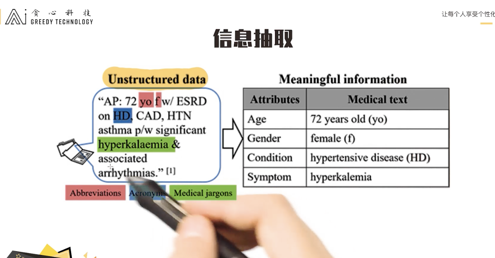
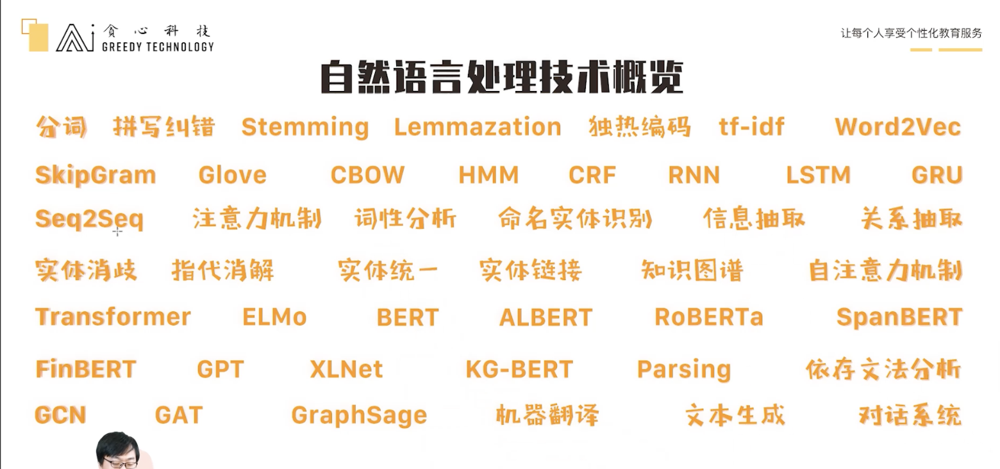

# 2 什么是自然语言处理
## 2.2 为什么自然语言处理难

一种含义，多种表达方式

一词多义

​	近三年的研究成果主要是联系上下文解决一词多义的问题，比如Bert

## 2.3 从一个简单的机器翻译系统说起

沿革：基于专家知识（语法）->基于概率统计的方法->基于深度学习的方法（自然语言生成）

机器翻译的进步不光归功于模型的进步，也归功于数据体量（语料库的增加）

基于概率统计的方法演示，后续深度学习模型发展也是基于这种方法论

基于概率统计的方法没有考虑语法

# 3 自然语言处理的应用

## 3.1 常见NLP应用场景

### V1 场景1 - 智能问答系统

很多平台都集成了智能问答系统，比如京东、淘宝等购物平台使用智能问答系统回答用户常见问题。问答系统的商业价值很高。

经典做法：

使用检索式的框架。收集一系列问题-答案对构建问答库，当用户问一个问题，就在Q-A库里检索这个问题。这也是市面上绝大多数问答系统的做法。

流程：

句子理解->检索(语义相似度匹配)->问题排序

智能问答系统可能每个模块看起来都不复杂，但只有把每个模块做到最好，才能得到理想中的系统

### V2 场景2 - 文本生成

- 生成报告
- 对产品生成营销文案
  - 产品图片+产品属性->一段描述文字
  
- 生成机器翻译的结果
- 摘要生成
  - 一段很长的文字->一段较短的文字
- 机器写文章、写诗

文本生成是一个很重要的领域

有结构、有规律的文本完全可以交给ai生成，再人工修改

### V3 场景3 - 机器翻译

一般的公司不会自己搭建机器翻译系统，网上有大量可用的机器翻译系统

机器翻译系统是一个非常经典的NLP应用场景

技术：文本生成，概率统计等

见2.3

### V4 场景4 - 情感分析

情感分析属于分类任务

短文本比长文本更难，因为长文本信息充足

情感分析领域已经存在将近20年，但还是有大量的研究针对文本情感分析，挑战在于如网络论坛的短文本，夹杂网络用语

即便有一个非常好的情感分析系统，也做不到95%以上的准确率

应用场景：

- 电商产品评论分析，分析用户对产品满意还是不满意

- 情报分析
  - 禁品分析
  - 舆情监控（实时分析网络发言，看有没有发生重大事件）
- 量化投资领域，根据情感分析辅助选股决策

### V5 场景5 - 聊天机器人

分为闲聊型和任务导向性，使用技术不一样

闲聊型更多使用生成式的方法

任务型更多使用**填槽式（slot filling）**或者**检索式**（在问答库里检索问题的答案）

### V6 场景6 - 虚假新闻检测

本质是二分类问题，所以可以使用情感分析里的技术来做

由于虚假新闻是通过社交网络进行传播的，所以结合社交网络信息（如传播路径，经常传播虚假新闻的人的权重），能提高模型表现。

应用价值：过滤掉虚假信息，关注更有意义的信息

### V7 场景7 - 文本主题分类

应用价值：博客平台将文章分为技术类、体育类、时尚类等，再针对不同的用户兴趣做推荐

多分类问题，类别很多，但是仍然可以用情感分类的技术来解决。这也是情感分类研究火爆的原因，因为它的技术可以迁移到别的场景。

### V8 场景8 - 信息抽取

信息抽取是自然处理领域又一大重要的领域

给定非结构化数据，提取出结构化数据，形成类似表格的结构

抽取出的信息可以当作特征来对待，也可以当作我们掌握的知识

例：AI医生

把网上的医学论文，医学教材（非结构化数据）全部爬下来，然后提取出结构化数据（学习过程），总结到标准化数据库

## 总结

除了以上应用之外，其实还有非常多的应用场景。即便针对于其中一个应用，我们也可以衍生出很多不一样的任务。这些内容在后续的课程中会逐个去涉及到。你也可以挑选一个自己最感兴趣的主题，自己去深挖。深度挖掘的方法很多，比如去系统性地看这个领域的知识，或者去调研相关的所有的文章。希望在课程结束之际，你对某一个领域还是有自己较深的认知，这个还是很有必要的。

# 4 自然语言处理核心技术

## 4.1 自然语言处理技术的三个维度

Semantic（语义） -> Syntax（句子结构） -> Morphology（单词）

对于以上三个维度，对于单词维度的技术是最基础的，比如分词、词性标注、单词的向量表示(用向量来表示一个单词)等等。这种我们也称之为down-stream tasks，因为起到了最为基础性的作用。如果在这些点，我们没有做好，那更不能做好对于句子层面上的，或者对于整篇文本层面上的分析。只有我们能把底层基础技术做好，才能更好地去服务上层应用。

打个比方，对于一个情感分析项目来说，它非常依赖于文本的表示，而且文本的表示又非常依赖于单词的表示。那这里的一个核心是如何更好的表示单词，回归到了down-stream tasks。

## 4.2 自然语言处理的几个关键技术

### V1 分词

### V2 词性分析

### V3 语义理解

### V4 命名实体识别 Named Entity Recognition (NER)

### V5 依存文法分析 Dependency Parsing

### V6 句法分析（句子结构分析）Parsing

上面所涉及到的技术，你均可以认为是比较基础的任务。它们的成败极大影响着对后续任务的性能。 比如计划搭建一个医疗领域的知识图谱，那就需要比较强大的命名实体识别技术;比如想更好地分析短文本，那就需要更强大的短文本语义理解模块等等。

在本章的最后，给大家看一下这门课程中即将会涉足到的一些关键技术，这也是一维合格工程师必须要掌握的技术。

### V7 课程中将会涉及到的关键技术

要学会使用及改进这些技术

