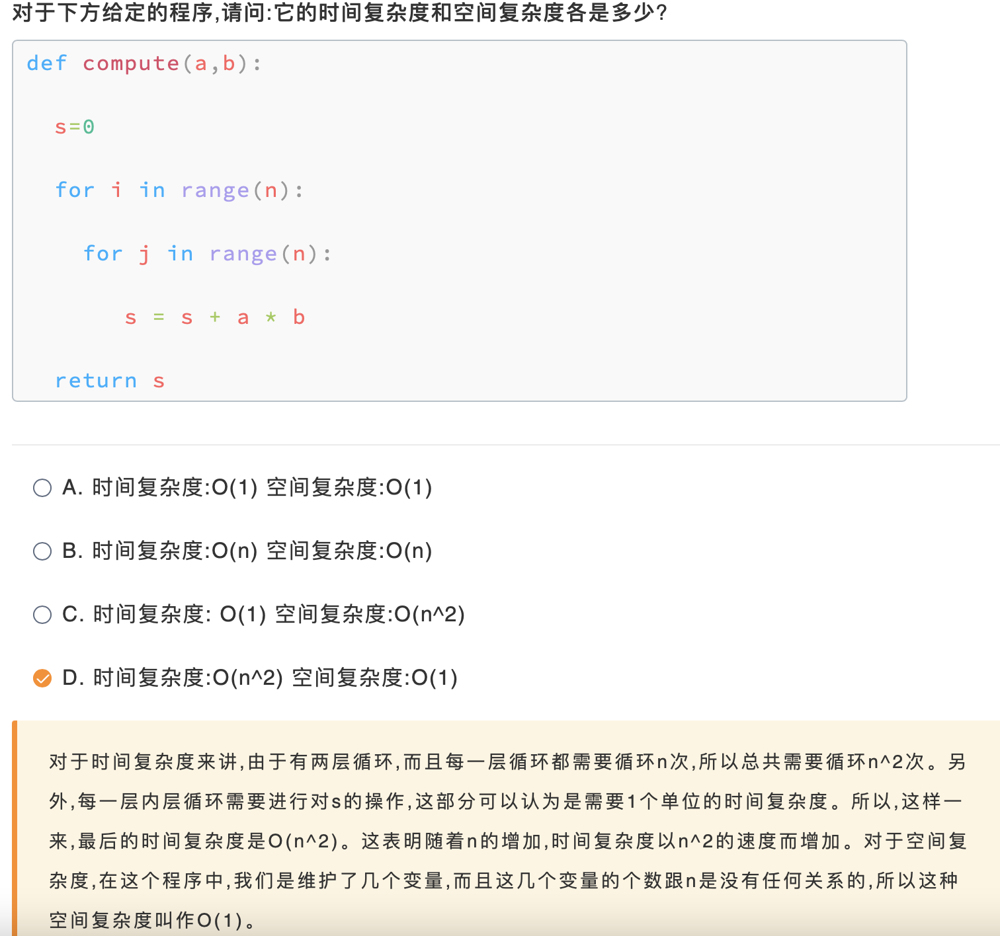
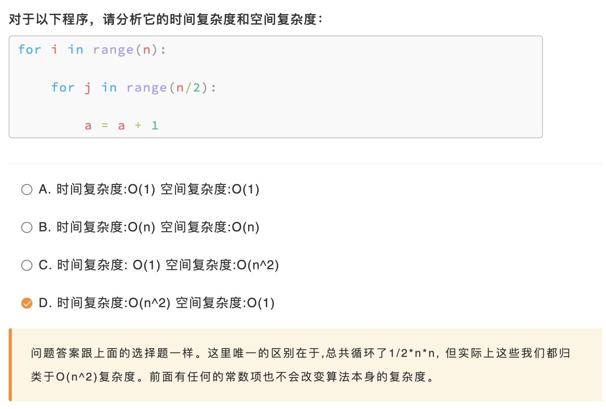
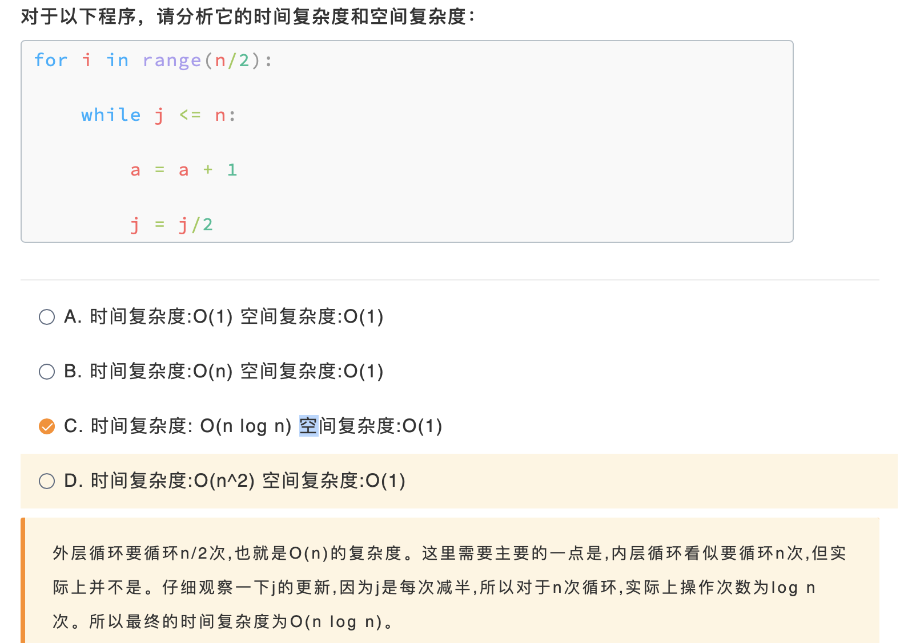
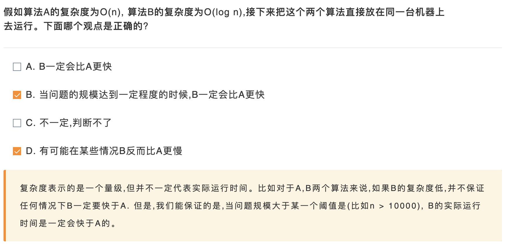
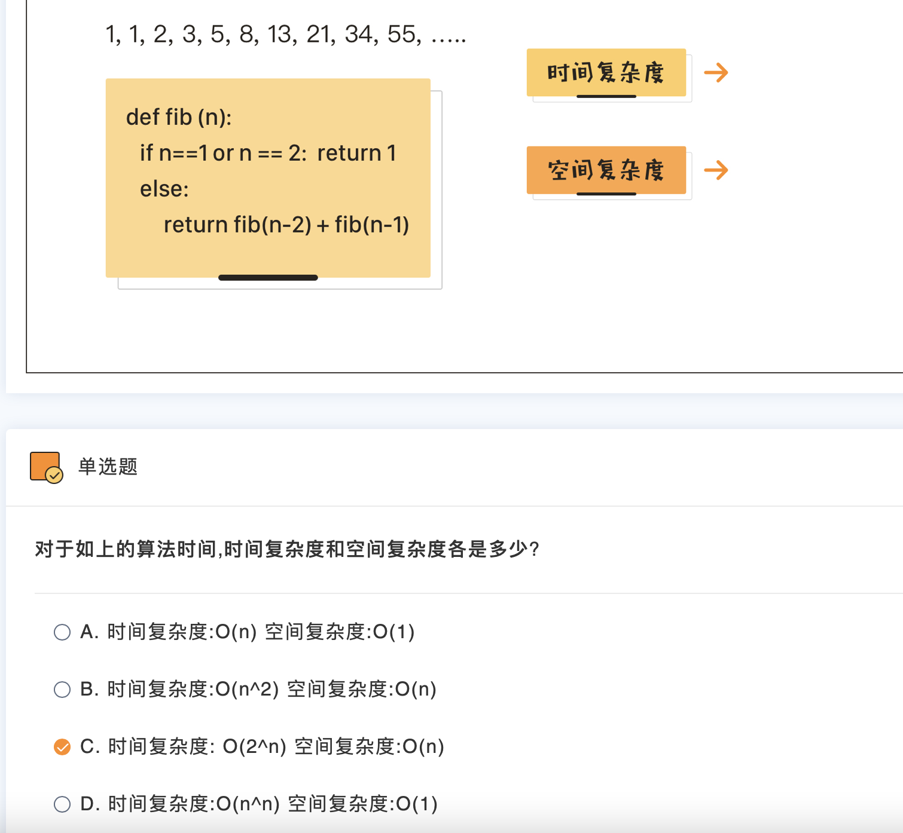
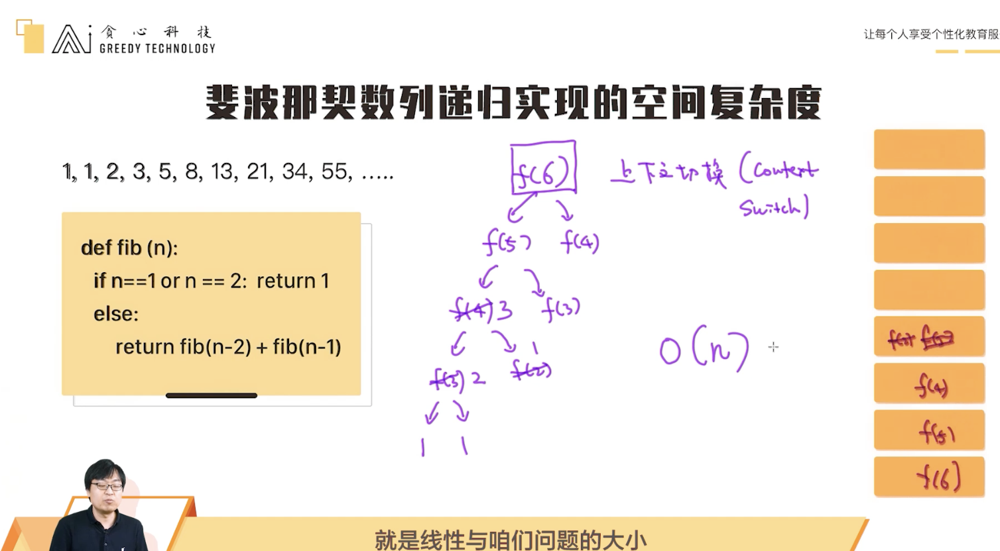

# 1. 为什么要重视这些

## 1.1 复杂度分析

### V1 算法复杂度

算法慢的第一反应不应该是加机器，而是分析算法复杂度：

复杂度的理解是必修课。在从事AI工作中经常会碰到各种各样程序效率低的问题，一个模型训练起来可能需要几天甚至几个月。这时候最直接的解决方式就是加机器，但也是最笨的方法。作为一名AI工程师，我们首先需要想到如何从根本上优化算法，比如检查是否使用了合理的数据结构? 如果一个程序需要经常做数据的查询，那这时候你要考虑用像哈希等合理的数据结构了。相反，如果你用的是列表(list)，查询速度就会变得很慢。

再比如，假设我们需要寻找一堆数据中的最大的几个数，很多人可能会选择先把所有的数做排序，之后在提取最大的前几个。但有没有比这个更高效的做法呢? 实际上，在这个场景，我们可以使用一个优先队列(priority queue)来更快速地做查询。 所以，你可以看到每一个小的细节决定了整个程序的效率。这也是为什么一定要重视算法复杂度的原因。

算法复杂度分为时间复杂度和空间复杂度

## 1.2 复杂度与真实时间消耗

## 1.3 递归函数的复杂度

V1 斐波那契数列计算的时间复杂度

斐波那契数列计算的时间复杂度可以写成2^0+2^1+...+2^(n-3)等比数列的形式，等比数列求和，是O(2^n)

计算很低效，可使用动态规划

V2 斐波那契数列计算的空间复杂度

递归时涉及上下文切换

# 2. 动态规划算法

**学习目标：**

动态规划（dynamic programming）算法在NLP领域经常可见，如编辑距离、维特比算法等等。在这一节，主要给大家介绍常见的动态规划问题以及如何使用动态规划来进行解决。

## 3.1 动态规划与自然语言处理

我们回想一下上一节讨论的斐波那契数列的递归实现。为什么这个递归实现的复杂度这个高? 归其原因，就是我们在不断地重复计算。所以解决此问题的关键点在于如何不做重复计算?想做到这一点，直接的方法就是已经计算好的结果先存下来，之后遇到计算需求时先看看有没有已经算好。如果已经算好了就直接使用，如果没有则进行计算。这就是动态规划的核心思想!

为了解决一个大的问题，我们从小问题开始解决。 但一点解决了小问题，我们就把这些问题的答案存放在内存空间为后续提供使用。所以对于动态规划算法有几个关键点:

- 思考如何把一个问题拆解成更小的子问题? 并把大问题以子问题的形式表示出来?

- 如何存放过程结果?

  ### V1 没听懂

多项式复杂度和指数级复杂度

对于算法复杂度来说，通常分类两大类，分为是多项式复杂度和指数级复杂度。多项式复杂度指的是类似于O(n^p)的复杂度，它包括了像O(1)， O(n)， O(n^2)， O(n logn)这类复杂度。指数级复杂度则可用O(p^n)来表示，斐波那契数列的递归时间就是属于指数级复杂度O(2^n)。

我们可以看一下它们之间的区别是什么。对于指数级复杂度来讲，我们的算法效率会随着问题的大小指数级增长，这其实是不可取的。可以想象一下，假如n=10或者n=100， 那复杂度p^10和p^100之间差别有多大。一般来讲，指数级复杂度算法只能适用在很小的问题上，一旦问题变大就没有办法使用了。

从复杂度理论的角度来讲，如果一个算法的复杂度为多项式复杂度，我们可以理解为这个问题是比较简单的问题;相反，如果为指数级复杂度，我们则认为是一个非常难的问题。所以，一旦在工作当中，有个同事提出的算法为指数级复杂度，那我们有必要想一想要不要接受上线了，很大概率上要毙掉!

## 3.2 最大递增子串